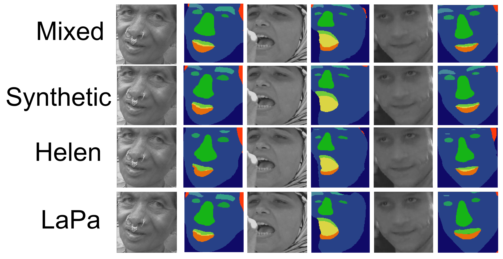
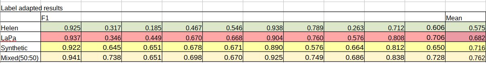
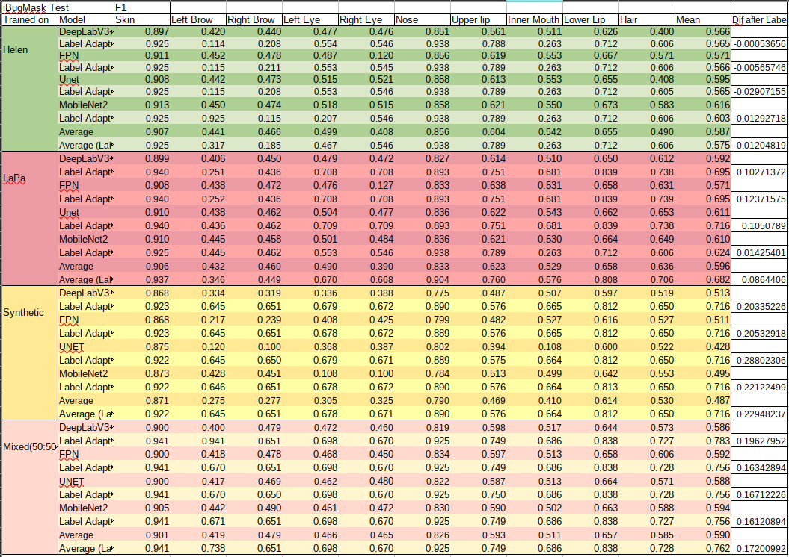
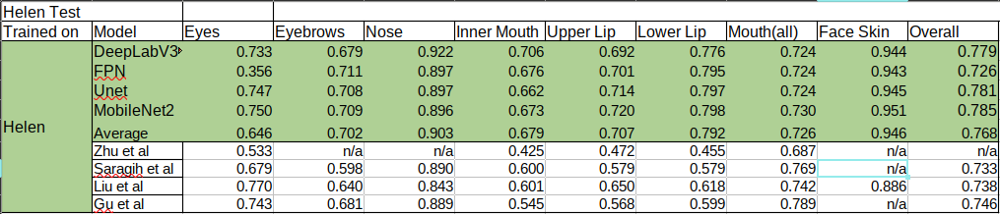
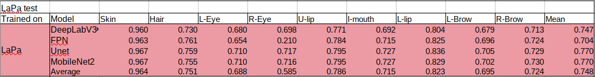
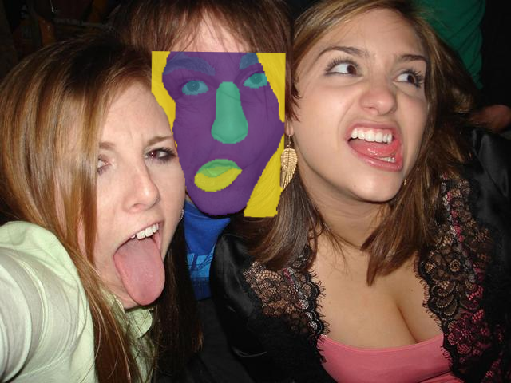

# Face Parsing in synthetic/real datasets with popular models

<li>Segmentaion experiments using DepplabV3+, Unet, FPN, and MobilenetV2
<li>Trained/tested on Helen, LaPa, and Microsoft's fully synthetic face DS
<li>Transfer learning tested on iBugMask300
  
 ## Usage

Research results can be found in /reasearch
* "ibug.ipynb" -> Transfer learning handler
* "helen.ipynb" -> Training and testing of models on Helen
* "label_adapter_fcn.ipynb" -> Training of FCN (to in-the-wild domain) Label Adapter
* "label_adapter_unet.ipynb" -> Training of UNET (to in-the-wild domain) Label Adapter
* "label_test_script.py" -> FCN and helper functions
* "lapa.ipynb" -> Training and testing of models on LaPa
* "mix.ipynb" -> Training and testing of models of domain mixed dataset (50:50) Synthetic:Real
* "wood.ipynb" -> Training and testing of models of purely synthetic face data

Unfinished and outdated code (not .ipynb form) can be found in /outdated_src

# Training Flow
  

  
# Testing Flow

  
# Results

### Final Results (iBugMask Test Sample)

### Full Results (iBugMask Test Sample)

### Helen Test Results (Models trained on Helen)

### LaPa Test Results (Models trained on LaPa)

# In the wild segments
In-the-wild face parses are then repositioned in the correct position. Demonstrating
segmentation ability in crowded/ challenging environments.

## License

[MIT](https://choosealicense.com/licenses/mit/)
