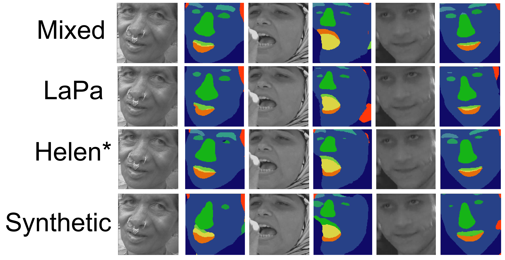
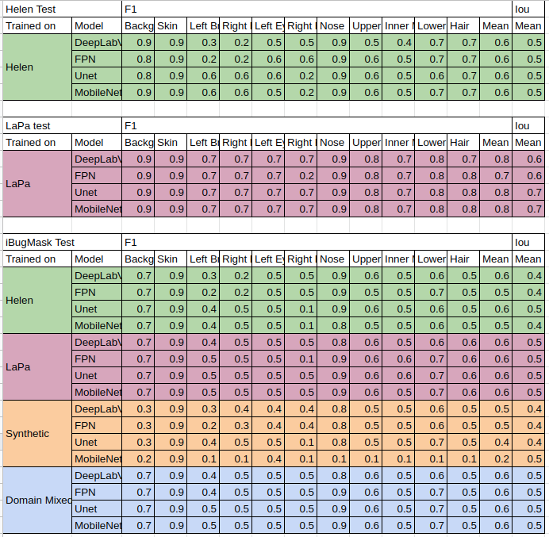
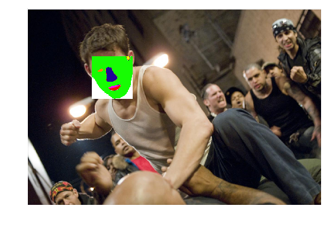

# Face Parsing in synthetic/real datasets with popular models

<li>Segmentaion experiments using DepplabV3+, Unet, FCN, and Mobilenet
<li>Trained/tested on Helen, LaPa, and Microsoft's fully synthetic DS
<li>Transfer learning tested on iBugMask300
  
 ## Usage

<li> All experiments found in "/notebooks"
<li> .py Version of the code not up to date with notebooks... (found in "/src")

# Process flow
  

  
# Preprocess flow
  

  
# Results

# In the wild segments

## License

[MIT](https://choosealicense.com/licenses/mit/)
