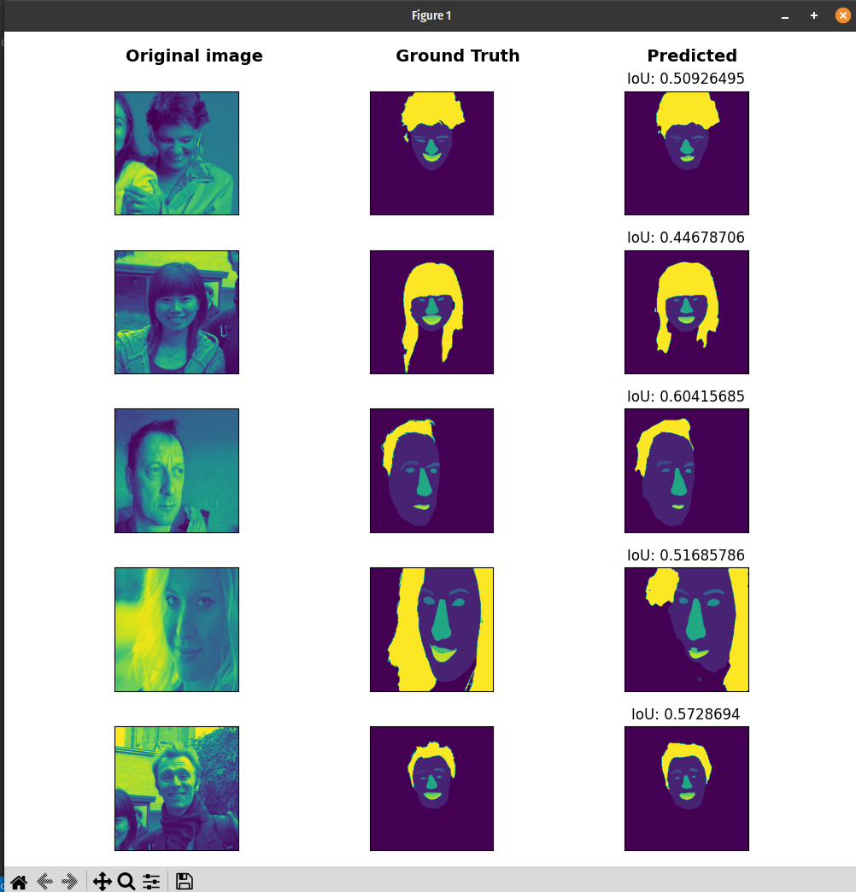

# Foobar

<li>Segmentaion experiments using DepplabV3+, Unet, FCN, and Mobilenet
<li>Trained/tested on Helen, LaPa, and Microsoft's fully synthetic DS
<li>Transfer learning tested on iBugMask300

## Usage

<li> Consult the notebooks in notebooks/ for research results
<li> Models such as true mobilenet and FCN can be found in src/models. These were later not used in the research.

## License

[MIT](https://choosealicense.com/licenses/mit/)